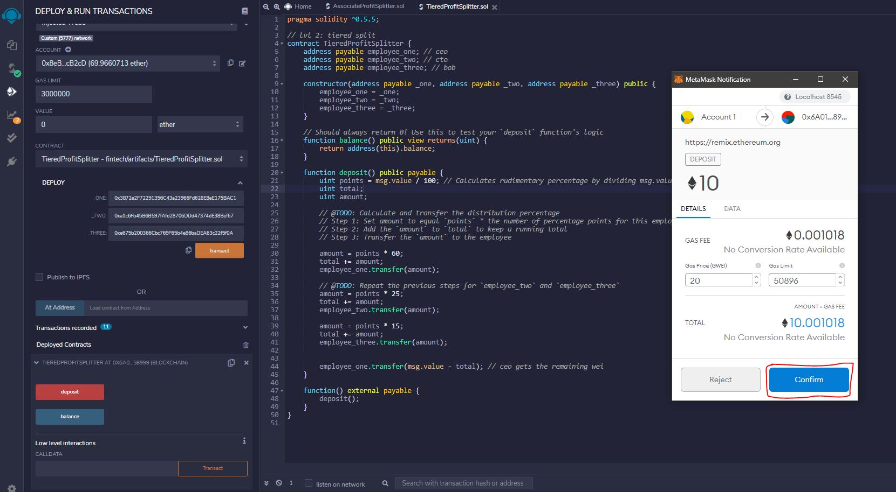

# Tiered Profit Splitter

Remix IDE Smart Contract Code:

1. We can then compile our smart contract, by clicking on the blue compile button.

2. ETH balances and addresses for our three employees before the transaction.

3. To initiate the payment to our employees we first have to deploy the contract to the three addresses recipients.

4. We can then click on transact, and a pop-up from metamask should appear to confirm our transaction. After clicking on confirm, the contract is deployed and it can be found in the bottom left corner of remix.

5. To send out the payment to our emplyees we can now enter the amount in the value field and click on deposit our deployed contract. (In this example we are going to send 10 ETH total, 6 ETH for CEO, 2.5 ETH for CTO, and 1.5 ETH for Bob)

6. We are going to confrim again on metamask to confrim our transaction.

7. To double check that our transaction has gone through, we can check the balances of our employees on Ganache. (As we can see their balance went from 105 ETH to 100 ETH)

